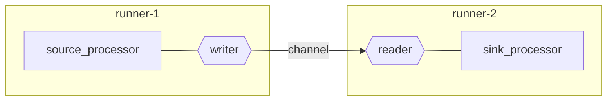

Welcome to the connector-architecture wiki!

When reading this wiki it should become clear what it is, and what it is not, but also how it can be extended, used, and played with.

## What is the connector architecture?

The connector architecture is configuration based way to write code once and reuse it everywhere.
It has a prime focus on being extendable, without restrictions. It is an ecosystem.

The connector architecture is designed with streaming data pipelines in mind. Here, the user configures their personal pipeline, from start to finish with pre-existing processors (parts of the pipeline). The power of the connector architecture is its extendability, this makes it possible to mix and match processors written in different programming languages.

## Small high level example

In this pseudo pipeline made with the connector architecture, one processor ("source_processor") sends some data to the other processor ("sink_processor"). A good example is a data ingestion pipeline. The source fetches data with a custom script from some API, because this is a custom script, it is written in javascript. The sink takes this data and stores it inside a specific database for later reuse.

The connector architecture makes the pipeline possible, by adding, `runners`. A runner takes in the pipeline configuration, which is runner agnostic and starts the corresponding processors. Runners are created once and reused over all pipelines, while processors can be more easily made per pipeline if this is desired.

The two processors communicate over a channel. This is a technology that both runners understand. Easy examples are websockets or TCP streams.

For more information you can check out the rest of the wiki, the [vocabulary](https://github.com/TREEcg/connector-architecture/wiki/Vocabulary-explained) page is a good starting place.